# STAMP: Graph Neural Network-Driven Spatial Multi-Omics Fusion & Clustering

> **S**patial **T**ranscriptome–**A**TAC **M**ulti-modal **P**airing — a graph neural network method that fuses paired spatial RNA-seq + ATAC-seq to identify spatial domains.

From literature survey → algorithm design → benchmark evaluation: a complete practice of **vibe coding** an end-to-end computational biology pipeline.

---
##The report is here！！！(last_report.pdf)

## Overview

Spatial multi-omics technologies co-detect transcriptomic (RNA) and epigenomic (ATAC) modalities on the same tissue slice while preserving spatial context. Fusing these highly heterogeneous modalities — RNA is high-dimensional but dropout-heavy, ATAC is extremely sparse (>95% zeros) — to recover accurate **spatial domains** is a core challenge.

**STAMP** tackles this with three design choices:

1. **Dual-Graph GAT Encoder** — each modality is encoded by a shared-weight GAT that simultaneously propagates over a *spatial graph* (kNN on coordinates) and a *feature graph* (kNN on PCA/LSI), fused by a learnable weight.
2. **Asymmetric Cross-Modal Attention** — only RNA queries ATAC (unidirectional), explicitly protecting the higher-quality ATAC modality from being polluted by noisy RNA.
3. **Cross-Modal Reconstruction** — each latent must reconstruct *both* modalities (4 MSE terms), a necessary constraint that prevents representation collapse.

### Headline Results

| Metric | Value |
|--------|-------|
| **Mean ARI (5 simulated datasets)** | **0.903** |
| Rank among 10 methods | 3rd (behind STARNet 0.971, SpatialGlue 0.936; ahead of STAGATE 0.894) |
| Real-data validation (P22 mouse brain) | ARI = 0.504 vs cortical-layer annotations |
| Core implementation | ~260 lines, stable training (early stop ~400–800 epochs) |

---

## Architecture

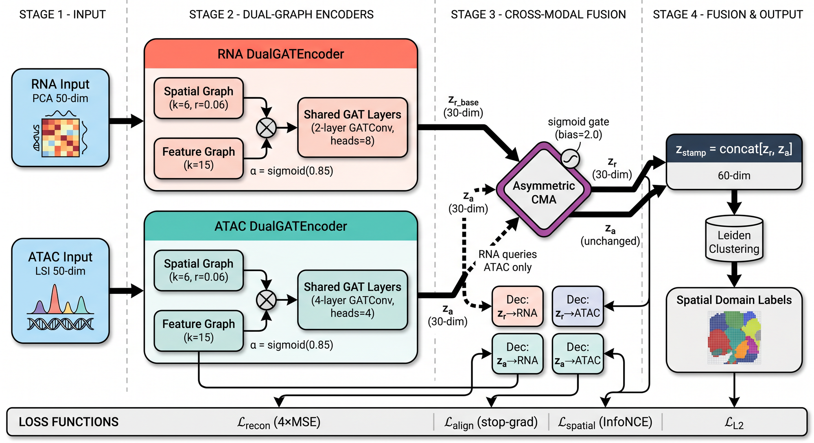

*Four stages: (1) Input — RNA (PCA-50d) & ATAC (LSI-50d); (2) Dual-Graph Encoders — shared-weight GAT over spatial (k=6, r=0.06) + feature (k=15) graphs, fused via α=sigmoid(0.85); (3) Asymmetric CMA — RNA queries ATAC only (sigmoid gate bias=2.0), with 4 cross-modal decoders for cycle-consistent reconstruction; (4) Fusion & Output — concat → 60-d `z_stamp` → Leiden clustering.*

### Data Flow

```
RNA (PCA-50d) --> DualGATEncoder --> z_r_base --┐
          ^ (spatial_graph + feature_graph)      │--> Asymmetric CMA --> z_r
ATAC (LSI-50d) --> DualGATEncoder --> z_a  ------┘
          ^ (spatial_graph + feature_graph)

z_stamp = concat([z_r, z_a]) --> Leiden --> Spatial domain labels
```

### Multi-Objective Loss

```
loss = loss_recon + loss_l2 + loss_align + loss_spatial + loss_spatial_r + loss_spatial_a
```

| Loss term | Role | Weight |
|-----------|------|--------|
| `loss_recon` | 4 cross-reconstruction MSE (cycle consistency) | 1.0 |
| `loss_l2` | latent L2 regularization | 1e-3 |
| `loss_align` | stop-gradient BYOL-style alignment | 0.1 |
| `loss_spatial` | InfoNCE on fused representation | 0.3 |
| `loss_spatial_r/a` | single-modality spatial contrastive | 0.1 |

---

## Benchmark Results

### ARI across 5 simulated datasets

| Method | D1 | D2 | D3 | D4 | D5 | **Mean ARI** |
|--------|-----|-----|-----|-----|-----|-------------|
| STARNet | — | 0.990 | **0.937** | **0.979** | **0.980** | **0.971** |
| SpatialGlue | **0.882** | **0.960** | 0.874 | 0.978 | **0.986** | 0.936 |
| **STAMP (ours)** | **0.815** | **0.863** | **0.915** | 0.961 | **0.962** | **0.903** |
| STAGATE | 0.818 | 0.936 | 0.852 | 0.902 | 0.962 | 0.894 |
| scGLUE | 0.566 | 0.729 | 0.637 | 0.666 | 0.732 | 0.666 |
| Scanpy | 0.503 | 0.652 | 0.439 | 0.690 | 0.760 | 0.609 |
| MultiVI | 0.300 | 0.571 | 0.542 | 0.430 | 0.670 | 0.503 |
| COSMOS | 0.062 | 0.444 | 0.403 | 0.700 | 0.675 | 0.457 |
| GraphST | 0.018 | 0.353 | 0.363 | 0.636 | 0.373 | 0.348 |

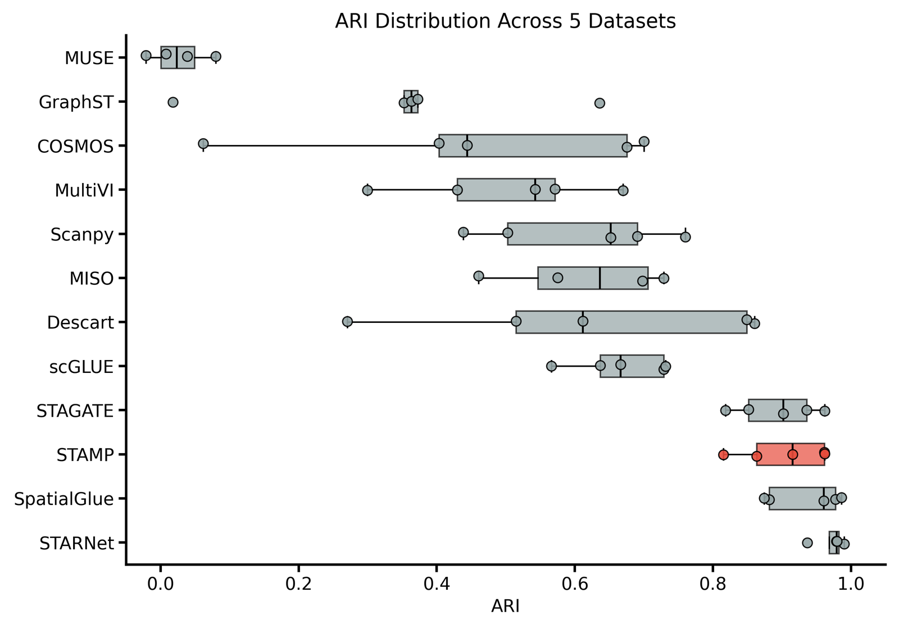

*ARI distribution over 10 methods × 5 datasets. STAMP (red, mean 0.903) shows the tightest spread, indicating robust consistency.*

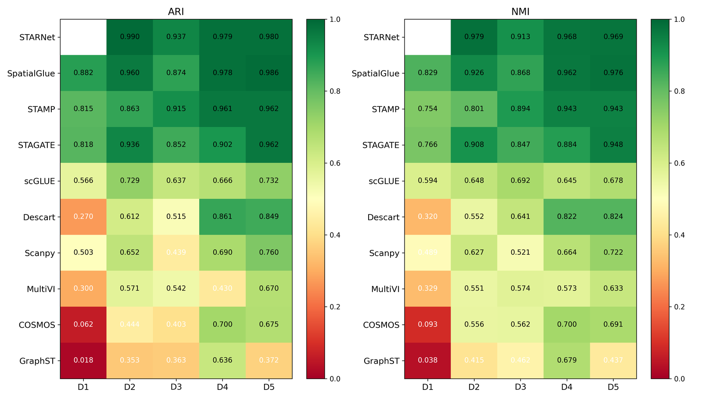

*ARI/NMI heatmap. Green = high performance; STAMP maintains strong green scores across all datasets, especially D3–D5.*

### Spatial domain identification (left: STAMP prediction, right: ground truth)

| Dataset 1 (ARI 0.815) | Dataset 2 (ARI 0.863) |
|:---:|:---:|
| 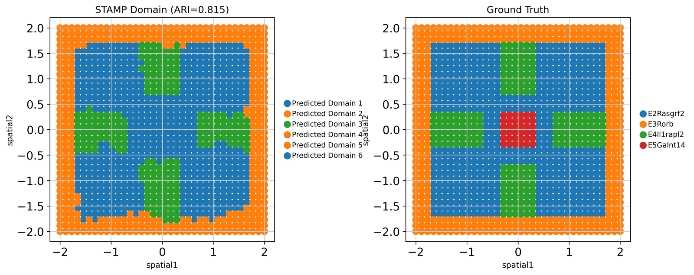 | 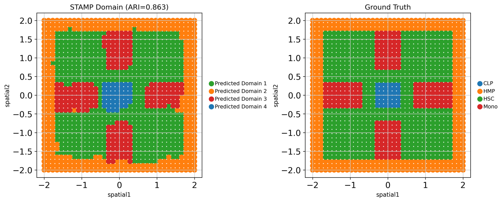 |

| Dataset 3 (ARI 0.915) | Dataset 4 (ARI 0.961) |
|:---:|:---:|
| 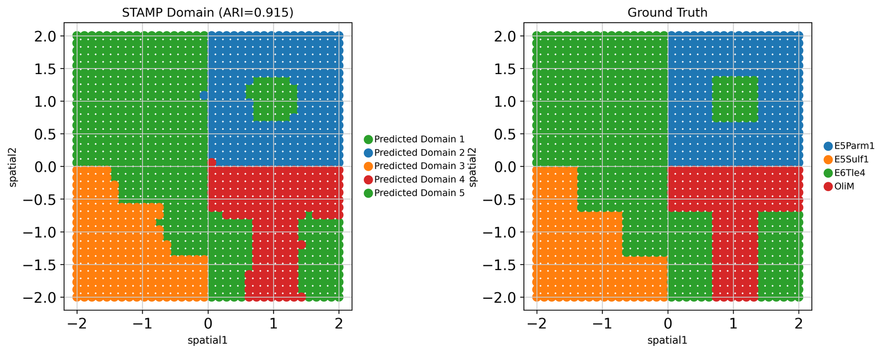 | 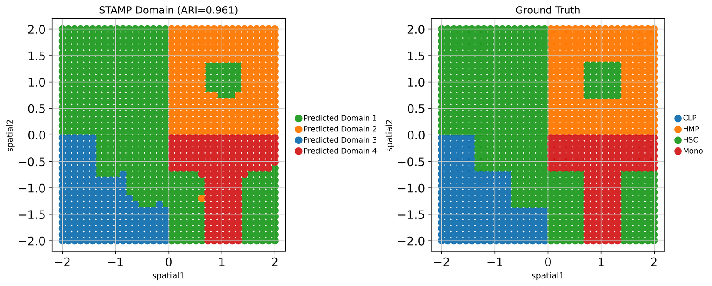 |

| Dataset 5 (ARI 0.962) |
|:---:|
| 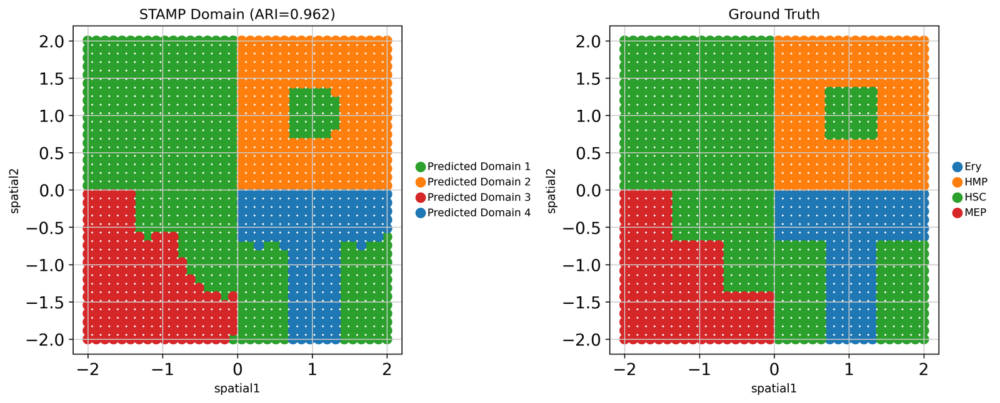 |

### UMAP of the fused 60-d embedding (left: predicted clusters, right: ground-truth cell types)

| Dataset 1 | Dataset 2 | Dataset 3 |
|:---:|:---:|:---:|
| 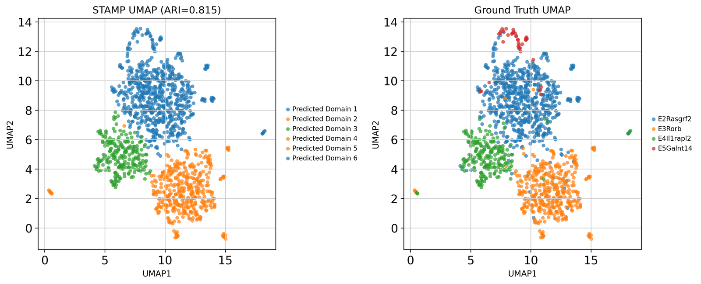 | 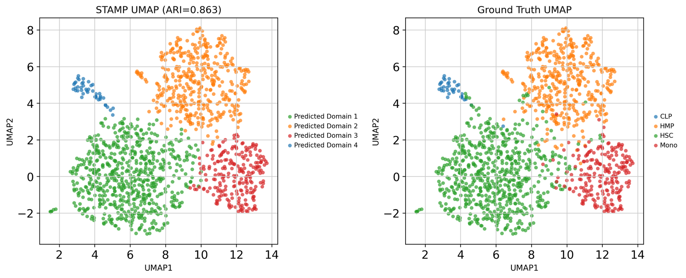 | 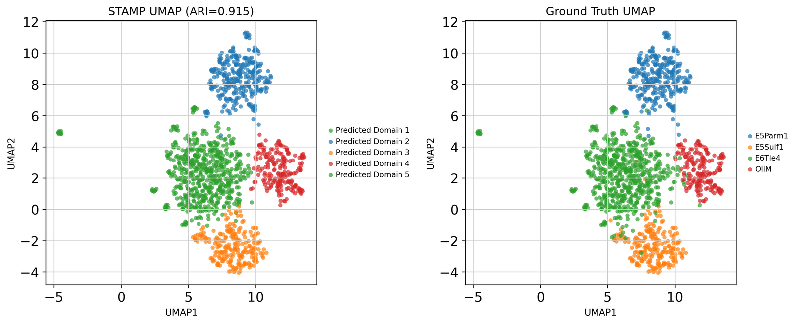 |

| Dataset 4 | Dataset 5 |
|:---:|:---:|
| 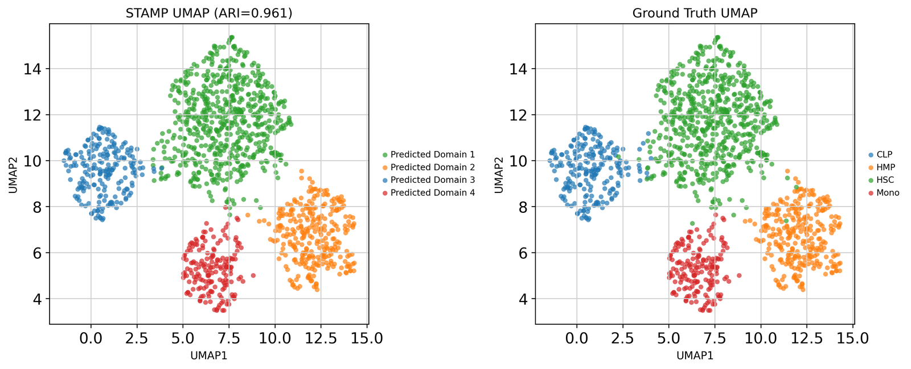 | 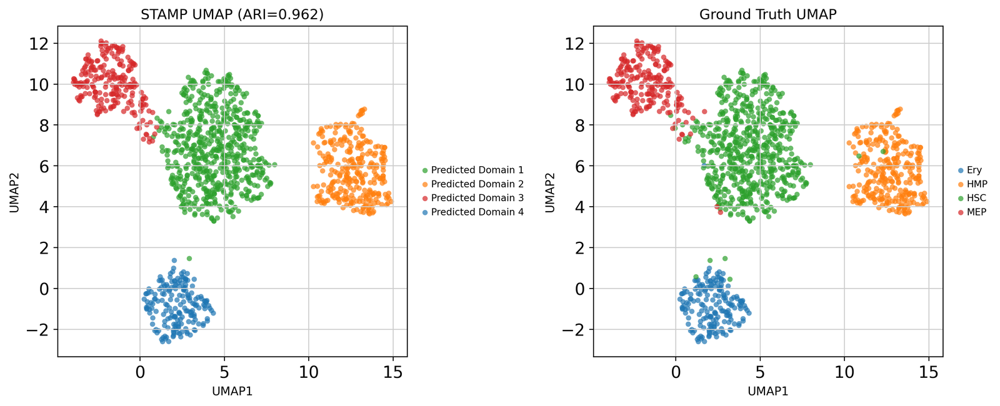 |

### Real-data generalization — P22 mouse brain (9,215 spots)

| Spatial domain | UMAP |
|:---:|:---:|
| 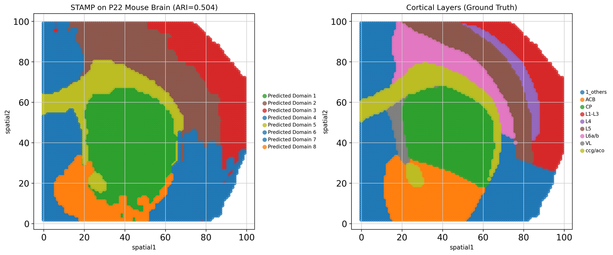 | 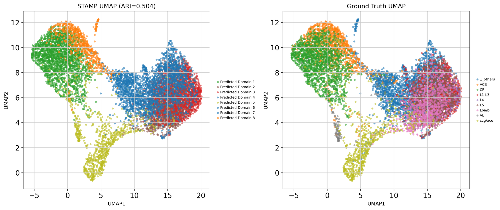 |

*STAMP reconstructs major cortical structures (corpus callosum, cortical plate, accumbens), demonstrating transferability beyond simulated data.*

---

## Design Validation (Ablations)

| Design choice | Variant | D1 ARI | Conclusion |
|--------------|---------|--------|------------|
| **Dual-graph** | single-graph | 0.77 → **0.815** | effective, +0.043 |
| Asymmetric CMA | bidirectional symmetric | 0.76 → 0.74 | asymmetry protects ATAC |
| Cross-modal reconstruction | self-recon only | — → 0.24 | **necessary** to prevent collapse |
| Stop-gradient alignment | direct MSE | 0.76 → 0.68 | stop-grad avoids symmetric collapse |
| PCA dim | PCA-100 / PCA-300 | 0.75 / 0.37 | PCA-50 optimal |

---

## Repository Structure

```
Assignment5/
├── README.md                         # this file
├── figures/                          # result figures (optimized, referenced by README)
│
├── code/                             # STAMP implementation
│   ├── stamp_model_v7a.py            #   model: DualGATEncoder + Asymmetric CMA + decoders
│   ├── stamp_utils.py                #   graph build, LSI, eval, spatial smoothing
│   ├── run_stamp_v7a.py              #   ★ training/eval entry point (per dataset)
│   ├── run_mousebrain.py             #   real-data validation (P22 mouse brain)
│   ├── run_all_datasets.py           #   run all 5 datasets
│   ├── batch_run_v7a.sh              #   batch runner
│   ├── benchmark_ari.csv / benchmark_nmi.csv          # baseline results
│   ├── benchmark_ari_v7a.csv / benchmark_nmi_v7a.csv  # STAMP v7a results
│   ├── benchmark_results.json
│   └── fix_*.py / regenerate_benchmark_plots.py       # plotting utilities
│
├── Fig2_Benchmark/                   # benchmark baselines
│   ├── *.ipynb                       #   SpatialGlue / GraphST / COSMOS / MultiVI ... notebooks
│   └── Descart_utlis.py
│
├── report_en.md                      # full report (English) — primary deliverable
├── report_full.md                    # full report
├── 技术报告.md                        # technical report (Chinese)
├── STAMP_algorithm.md                # algorithm design document
├── 融合算法调研.md                    # literature survey notes
└── generate_report.py / generate_report_v7a.py / regen_pdf.py
```

> **Note on data**: the ~3.3 GB of raw/processed benchmark data (`Fig2_Benchmark/Original_*`, `Processed_Simulated_Data/`, `Reference/`, etc.) and trained model checkpoints (`code/best_model*.pt`) are **excluded** from this repository due to size. See *Reproduction* below.

---

## Reproduction

### 1. Environment

```bash
conda create -n stamp python=3.10 -y && conda activate stamp
pip install torch torch_geometric scanpy scikit-learn scipy numpy matplotlib pillow
```

### 2. Data

Place simulated datasets under `Fig2_Benchmark/Original_Simulated_Data/Simulated_Dataset_{1..5}/` (paired RNA + ATAC `AnnData` with `obsm['spatial']` and `obs['cell_type']`).

### 3. Train & evaluate

```bash
# single dataset
python code/run_stamp_v7a.py --dataset 1

# all 5 datasets
bash code/batch_run_v7a.sh
```

> The scripts contain absolute paths (e.g. `DATA_DIR = '.../Assignment5/Fig2_Benchmark/...'`). Adjust `DATA_DIR`, `OUT_DIR`, `CODE_DIR` at the top of `code/run_stamp_v7a.py` to match your layout.

### 4. Real-data validation

```bash
python code/run_mousebrain.py
```

### Key hyperparameters

| Parameter | Value |
|-----------|-------|
| Optimizer | Adam (lr 1e-3, wd 1e-4) |
| LR schedule | CosineAnnealingLR (T_max=500, eta_min=1e-5) |
| Max epochs | 1500 (early stop patience 200) |
| Seed | 42 |
| Spatial graph | kNN k=6, radius=0.06 |
| Feature graph | kNN k=15 (PCA/LSI-50d) |

---

## Method Comparison

| Dimension | SpatialGlue | SpaDDM | **STAMP** |
|-----------|-------------|--------|-----------|
| Fusion direction | bidirectional symmetric | diffusion + attention | **asymmetric (RNA←ATAC)** |
| Graph strategy | dual independent encoders | directional diffusion | **dual-graph shared-weight encoder** |
| Core constraint | attention interpretability | physical prior | **cross-modal reconstruction cycle** |
| Reconstruction | none | none | **mandatory bidirectional** |

---

## Reports

Full write-ups live in this repo:

- **`report_en.md`** — complete report (literature survey, method, implementation, benchmark, ablation, vibe-coding process). *Start here.*
- `技术报告.md` — Chinese technical report
- `STAMP_algorithm.md` — algorithm design & notation
- `融合算法调研.md` — literature survey notes

---

## References

1. Long Y, et al. *Deciphering spatial domains from spatial multi-omics with SpatialGlue.* Nature Methods. 2024;21:1658-1667.
2. Miao J, et al. *MultiGATE: integrative analysis … via graph representation learning.* Nature Communications. 2025;16:9403.
3. Yan X, et al. *Mosaic integration of spatial multi-omics with SpaMosaic.* Nature Genetics. 2026.
4. Long Y, et al. *Spatially informed clustering … with GraphST.* Nature Communications. 2023;14:1155.

---

## Course

**Spatial Multi-Omics Clustering: Design, Implementation and Benchmark** · May 2026

*This project was developed as a vibe-coding practice: literature survey → algorithm design → implementation → benchmark, with AI-assisted iteration from an ambitious multi-component design to a streamlined, validated final method (STAMP).*
